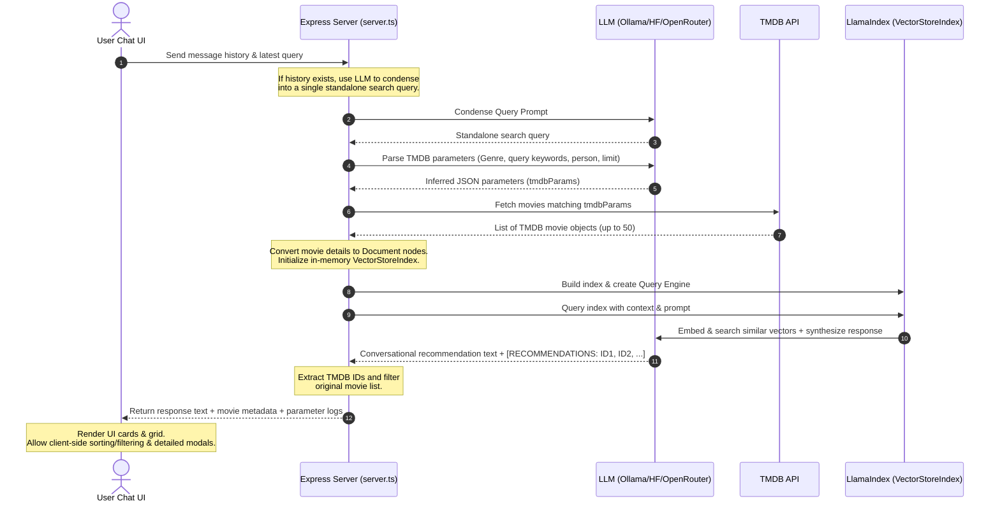

# CineRAG 🎬 - Conversational Movie Recommendation Explorer

CineRAG is an intelligent, high-performance conversational movie recommendation assistant. It utilizes a **hybrid search + dynamic Retrieval-Augmented Generation (RAG) architecture** to understand user queries semantically and recommend movies from **The Movie Database (TMDB)**. 

The application is built on a fully customizable, free-tier-friendly AI stack that supports running **completely offline/locally** using **Ollama**, or **serverless/anonymously** via **Hugging Face Serverless Inference API**.

---

## 🚀 Key Features

*   **Semantic Conversational Search**: Chat with an LLM that understands film themes, tropes, directing/acting styles, complex plots, or release-date relationships.
*   **Dynamic RAG Pipeline**: Movie results are dynamically fetched in real-time from TMDB based on parsed query parameters, instantly converted into vector-indexable document nodes, and loaded into an in-memory `VectorStoreIndex` powered by LlamaIndex.
*   **Flexible AI Provider Stack**:
    *   **Ollama (Local/Offline)**: Uses locally hosted models (e.g. `gemma4:31b-cloud` / `nomic-embed-text`) for both query-completion and embedding generation.
    *   **Hugging Face Inference (Free/Serverless)**: Custom non-token/token-authenticated API wrappers (`HFLLM` and `HFEmbedding`) to leverage open-source models (like `Qwen/Qwen2.5-7B-Instruct`) for 100% free serverless API calls.
    *   **OpenRouter (SaaS)**: Supports standard cloud integrations with commercial/free remote LLM models if preferred.
*   **Robust Query Extraction & Sanitization**: Advanced prompt logic filters search queries to extract semantic subjects (e.g. mapping "best rated romantic movies" -> genre ID `10749` and `vote_average` filters), resolving zero-results search bugs.
*   **Cinematic Dark Theme UI**: A beautifully crafted dashboard styled with curated dark hues, gradients, glowing components, and micro-animations.
*   **Interactive Movie Grid & Detail Modals**:
    *   Dynamic card layouts featuring movie posters, ratings, and release metadata.
    *   Client-side **sorting capability** by rating, date, or popularity.
    *   An interactive **overlay detail modal** with deep-dive overviews and direct links to TMDB.

---

## 📐 System Architecture

The workflow below details how a query gets transformed into a list of semantic movie recommendations:



---

## 🛠️ Tech Stack

*   **Frontend**: React (v19), Tailwind CSS, Framer Motion (via `motion/react`), Lucide Icons, Radix UI Tooltip, React-Markdown.
*   **Backend**: Node.js, Express, `llamaindex` (LlamaIndex TS SDK), `@llamaindex/ollama`, `@llamaindex/openai`.
*   **Development / Build Tools**: Vite (v6), esbuild, `tsx` (TypeScript Executor).

---

## ⚙️ Environment Configuration

To run the application, configure your `.env` file. A sample configuration template is provided in `.env.example`:

```ini
# Model Providers Configuration
# LLM Provider: "huggingface", "ollama", or "openrouter"
LLM_PROVIDER="ollama"
LLM_MODEL="gemma4:31b-cloud"

# Embedding Provider: "huggingface" or "ollama"
EMBEDDING_PROVIDER="ollama"
EMBEDDING_MODEL="nomic-embed-text"

# Hugging Face Access Token (Optional: Can be left empty for anonymous calls)
HF_TOKEN=""

# TMDB Movie Database API Credentials (Bearer Token)
TMDB_BEARER_TOKEN="your_tmdb_bearer_token_here"

# App Settings
APP_URL="http://localhost:3000"
```

### 1. Setting Up TMDB API
1. Visit [The Movie Database (TMDB)](https://www.themoviedb.org/) and log in or register.
2. Navigate to your Account Settings -> **API** section.
3. Request an API key (developer category).
4. Copy your **API Read Access Token (Bearer Token)** and paste it as `TMDB_BEARER_TOKEN` in `.env`.

### 2. Setting Up Ollama (Offline Mode)
To run local models:
1. Download and install [Ollama](https://ollama.com/).
2. Start the Ollama background service.
3. Pull the embedding model in your terminal:
   ```bash
   ollama pull nomic-embed-text
   ```
4. Pull the LLM of your choice (e.g. `gemma:2b`, `llama3`, or `gemma4:31b-cloud` if using local custom tags):
   ```bash
   ollama run gemma4:31b-cloud
   ```
5. Ensure your `.env` lists `"ollama"` as your providers.

### 3. Setting Up Hugging Face (Free Cloud Mode)
If you do not want to run local models or lack system memory:
1. Set `LLM_PROVIDER="huggingface"` and `EMBEDDING_PROVIDER="huggingface"`.
2. Configure `LLM_MODEL` (e.g., `"Qwen/Qwen2.5-7B-Instruct"`) and `EMBEDDING_MODEL` (e.g., `"BAAI/bge-small-en-v1.5"`).
3. If you have a Hugging Face Account, generate a Read Access Token from Settings and set `HF_TOKEN="your_hf_token"`. Leaving it blank will attempt anonymous free-tier API inference.

---

## 🏃 Run Locally

### Prerequisites
*   Node.js (v18 or higher)
*   npm

### Steps
1.  **Clone & Install Dependencies**:
    ```bash
    npm install
    ```
2.  **Configure environment**:
    Create a `.env` file at the root using the instructions above.
3.  **Start Development Server**:
    ```bash
    npm run dev
    ```
    This launches the Node/Express server and hooks Vite middleware. The backend watch tool `tsx watch` triggers automatic reloads if you modify code or update the `.env` settings.
4.  **Open Browser**:
    Navigate to [http://localhost:3000](http://localhost:3000) to start exploring movies!

---

## 📦 Building for Production

To clean and compile the application for a standalone Node server deployment:

1.  **Build Server and Client**:
    ```bash
    npm run build
    ```
    This builds the React static files via Vite to `dist/`, and uses `esbuild` to compile `server.ts` into a bundled, single-file CommonJS production script `dist/server.cjs`.
2.  **Run Production Server**:
    ```bash
    npm run start
    ```
    The application will serve static assets from `dist/` and expose the recommendation endpoints under [http://localhost:3000](http://localhost:3000).
