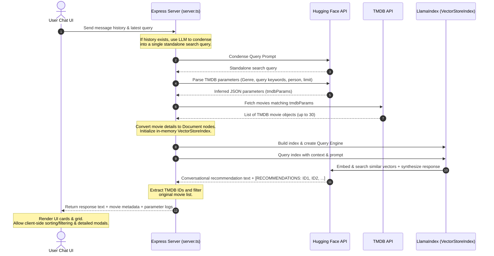

# CineRAG 🎬 — Conversational Movie Recommendation Explorer

CineRAG is an intelligent, high-performance conversational movie recommendation assistant. It utilizes a **hybrid search + dynamic Retrieval-Augmented Generation (RAG) architecture** to understand user queries semantically and recommend movies from **The Movie Database (TMDB)**.

The application uses **Hugging Face Serverless Inference API** for both the LLM and embedding generation, making it fully cloud-based with no local GPU or model hosting required.

---

## 🚀 Key Features

*   **Semantic Conversational Search**: Chat with an LLM that understands film themes, tropes, directing/acting styles, complex plots, or release-date relationships.
*   **Dynamic RAG Pipeline**: Movie results are dynamically fetched in real-time from TMDB based on parsed query parameters, instantly converted into vector-indexable document nodes, and loaded into an in-memory `VectorStoreIndex` powered by LlamaIndex.
*   **Hugging Face AI Stack**:
    *   **LLM**: Custom `HFLLM` wrapper around the Hugging Face Serverless Inference API (default model: `Qwen/Qwen2.5-7B-Instruct`).
    *   **Embeddings**: Custom `HFEmbedding` wrapper for feature-extraction models (default model: `BAAI/bge-small-en-v1.5`).
*   **Robust Query Extraction & Sanitization**: Advanced prompt logic filters search queries to extract semantic subjects (e.g. mapping "best rated romantic movies" → genre ID `10749` and `vote_average` filters), resolving zero-results search bugs.
*   **Cinematic Dark Theme UI**: A beautifully crafted dashboard styled with curated dark hues, gradients, glowing components, and micro-animations.
*   **Interactive Movie Grid & Detail Modals**:
    *   Dynamic card layouts featuring movie posters, ratings, and release metadata.
    *   Client-side **sorting capability** by rating, date, or popularity.
    *   An interactive **overlay detail modal** with deep-dive overviews and direct links to TMDB.

---

## 📐 System Architecture

The workflow below details how a query gets transformed into a list of semantic movie recommendations:



---

## 🛠️ Tech Stack

*   **Frontend**: React (v19), Tailwind CSS, Framer Motion (via `motion/react`), Lucide Icons, Radix UI Tooltip, React-Markdown.
*   **Backend**: Node.js, Express, `llamaindex` (LlamaIndex TS SDK).
*   **AI Provider**: Hugging Face Serverless Inference API (LLM + Embeddings).
*   **Movie Data**: The Movie Database (TMDB) API.
*   **Development / Build Tools**: Vite (v6), esbuild, `tsx` (TypeScript Executor).

---

## ⚙️ Environment Configuration

To run the application, configure your `.env` file. A sample configuration template is provided in `.env.example`:

```ini
# Hugging Face AI Configuration
LLM_PROVIDER="huggingface"
LLM_MODEL="Qwen/Qwen2.5-7B-Instruct"

EMBEDDING_PROVIDER="huggingface"
EMBEDDING_MODEL="BAAI/bge-small-en-v1.5"

# Hugging Face Access Token (required)
HF_TOKEN="your_hf_token_here"

# TMDB Movie Database API Credentials (required)
TMDB_BEARER_TOKEN="your_tmdb_bearer_token_here"

# App Settings
APP_URL="http://localhost:3000"
```

### Required Environment Variables

| Variable | Description |
|---|---|
| `HF_TOKEN` | Hugging Face access token. Generate a **Read** token from [Hugging Face Settings → Tokens](https://huggingface.co/settings/tokens). |
| `TMDB_BEARER_TOKEN` | TMDB API Read Access Token (Bearer). Get it from [TMDB API Settings](https://www.themoviedb.org/settings/api). |
| `LLM_MODEL` | Hugging Face model ID for the LLM (default: `Qwen/Qwen2.5-7B-Instruct`). |
| `EMBEDDING_MODEL` | Hugging Face model ID for embeddings (default: `BAAI/bge-small-en-v1.5`). |

### Setting Up TMDB API
1. Visit [The Movie Database (TMDB)](https://www.themoviedb.org/) and log in or register.
2. Navigate to your Account Settings → **API** section.
3. Request an API key (developer category).
4. Copy your **API Read Access Token (Bearer Token)** and paste it as `TMDB_BEARER_TOKEN` in `.env`.

### Setting Up Hugging Face
1. Create an account at [Hugging Face](https://huggingface.co/).
2. Navigate to Settings → [Access Tokens](https://huggingface.co/settings/tokens).
3. Generate a **Read** access token.
4. Set `HF_TOKEN` in your `.env` file with the generated token.

---

## 🏃 Run Locally

### Prerequisites
*   Node.js (v18 or higher)
*   npm

### Steps
1.  **Clone & Install Dependencies**:
    ```bash
    npm install
    ```
2.  **Configure environment**:
    Create a `.env` file at the root using the instructions above.
3.  **Start Development Server**:
    ```bash
    npm run dev
    ```
    This launches the Node/Express server and hooks Vite middleware. The backend watch tool `tsx watch` triggers automatic reloads if you modify code or update the `.env` settings.
4.  **Open Browser**:
    Navigate to [http://localhost:3000](http://localhost:3000) to start exploring movies!

---

## ☁️ Deploying to Vercel

1.  Push your repository to GitHub.
2.  Import the project into [Vercel](https://vercel.com/).
3.  Add the following **Environment Variables** in the Vercel dashboard (Settings → Environment Variables):
    *   `HF_TOKEN`
    *   `TMDB_BEARER_TOKEN`
    *   `LLM_MODEL`
    *   `EMBEDDING_MODEL`
4.  Deploy the project.

> **Important**: After changing any Vercel environment variable, you must **redeploy** the project for the changes to take effect.

---

## 📦 Building for Production

To clean and compile the application for a standalone Node server deployment:

1.  **Build Server and Client**:
    ```bash
    npm run build
    ```
    This builds the React static files via Vite to `dist/`, and uses `esbuild` to compile `server.ts` into a bundled, single-file CommonJS production script `dist/server.cjs`.
2.  **Run Production Server**:
    ```bash
    npm run start
    ```
    The application will serve static assets from `dist/` and expose the recommendation endpoints under [http://localhost:3000](http://localhost:3000).
